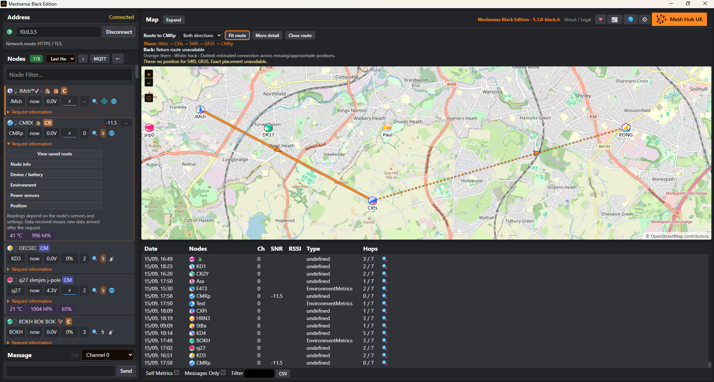

# Meshsense Black Edition

An independent community modification of [MeshSense by Affirmatech](https://github.com/Affirmatech/MeshSense), for monitoring and mapping Meshtastic networks. This is not an official Affirmatech release.

## Downloads



Download **1.1.0-black.6**, currently a testing pre-release, from [GitHub Releases](https://github.com/jamesjsm/Meshsense-Black-Edition/releases/tag/v1.1.0-black.6).

| Computer | Download ending |
| --- | --- |
| Windows Intel/AMD 64-bit | `-x64.exe` |
| Linux desktop Intel/AMD 64-bit, including Linux Mint | `-linux-x64.AppImage` |
| Mac Apple Silicon | `-macos-arm64.dmg` |
| Intel Mac | `-macos-x64.dmg` |
| Raspberry Pi with 64-bit OS | `-pi-arm64-headless.tar.gz` |

Read the matching README asset for installation. Linux desktop users must allow executing the AppImage as a program. The Pi package runs without Electron or a desktop and requires Node.js 24; follow the [Pi installation guide](pi/README-PI.md), including SSH-tunnel browser access.

Windows builds are unsigned. Mac builds are ad-hoc signed and not notarised; see [Mac connection testing](MAC-CONNECTION-TEST.md) for remaining Local Network permission limitations. Automated builds and startup checks have passed for all five targets, but this does not establish complete real-device compatibility.

## Features

- Charcoal theme with orange highlights and a link to [MeshHub UK](https://meshhub.uk/).
- Separate outward and return traceroutes, with missing-position sections distinguished on the map.
- Mesh overview links when no individual route is selected.
- Compact node-data requests for node information, telemetry and position, with cooldowns and dismissing status messages.
- Bounded connection retries, connection timeouts and explicit persistent TLS settings.
- Selectable GitHub builds for Windows, both Mac architectures, Linux desktop and Raspberry Pi headless.

## Build this edition

Clone this repository:

```sh
git clone https://github.com/jamesjsm/Meshsense-Black-Edition.git
cd Meshsense-Black-Edition
```

Follow [GitHub build instructions](GITHUB-BUILDS.md) for hosted builds, or [local build instructions](BUILD-CUSTOM.md). Dependency source directories are populated in this repository; keep their pinned contents. The fork's build entry point is `build-custom.mjs`.

## Source and attribution

Licensed under GNU GPL version 3; see [LICENSE](LICENSE), [modification notices](MODIFICATIONS.md) and [third-party notices](THIRD-PARTY-NOTICES.txt). Original MeshSense copyright and attribution are retained. No endorsement by Affirmatech is claimed.

Each application release has a matching platform-labelled source ZIP containing source, dependency sources, notices and build instructions. Keep that matching source available alongside any redistributed application package. GitHub's automatically generated repository archives are separate from these prepared source packages.
